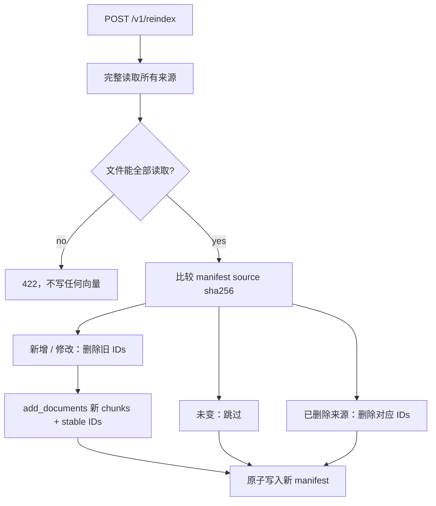

# 架构说明

## 两条数据流

```mermaid
flowchart LR
    A[data/source Markdown / PDF] --> B[loader\nsource hash + metadata]
    B --> C[RecursiveCharacterTextSplitter\nstart_index]
    C --> D[stable chunk_id\nsource/page/index/content hash]
    M[embedding mode\nlocal MiniLM / hash / glm] --> E
    D --> E[(Chroma\npersist_directory)]
    D --> F[index_manifest.json\nsource sha256 -> chunk IDs]

    Q[question] --> G[similarity retrieval]
    E --> G
    G --> H{answerability gate\nscore >= threshold?}
    H -- no --> I[固定拒答\nanswerable=false]
    H -- yes / offline --> J[可检查的检索摘录]
    H -- yes / live --> K[prompt | Qwen兼容ChatOpenAI | StrOutputParser]
    J --> L[citations + retrieval + request_id]
    K --> L
```

## 增量索引规则



配置指纹包含 chunk 参数、embedding 身份和 collection 名称。若指纹变化，调用方必须显式 `reset=true`；这样不会把不同 embedding 语义混入同一向量集合。

`RAG_EMBEDDING_MODE` 与 `RAG_MODE` 相互独立。本机默认用 `local` MiniLM 检索；`RAG_MODE=live` 只切换回答生成。Hash 保留给 CI，GLM embedding 只作为显式在线对照。

## 并发边界

学习版服务以单个 Uvicorn worker 运行，服务层的 `RLock` 串行化 reindex 与 ask。这样既能让 manifest 和本地 Chroma 的写入保持一致，也把未来“多进程、队列、分布式向量库”的升级边界明确留下。
