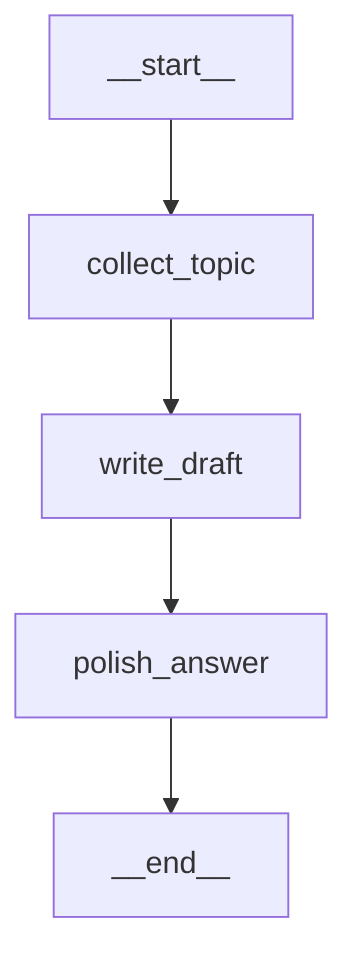

# LangGraph 基础语法笔记

这份笔记整理 `andrew` 项目中 [5_langgraph_agentic_rag](5_langgraph_agentic_rag) 逐步学习到的 LangGraph 语法和运行机制。

本文按实际学习进度持续补充，不提前展开尚未学习的章节。当前学习到：

```text
Part 1：State、Node、Edge、Conditional Edge、compile、invoke
```

当前项目使用 `langgraph 1.2.8`。Part 1 示例见
[part1_graph_basics.py](5_langgraph_agentic_rag/part1_graph_basics.py)。

## 1. 常用术语

| 英文 | 发音近似 | 在 LangGraph 中的含义 |
| --- | --- | --- |
| Agentic | 诶-坚-提克 | 具备自主判断和选择下一步能力的 |
| Graph | 格拉夫 | 由节点和边组成的执行图 |
| State | 斯得特 | 节点之间共享的数据 |
| Node | 诺德 | 读取 State、执行逻辑并返回状态更新 |
| Edge | 诶句 | 从一个节点连接到另一个节点 |
| Router | 路由器 | 读取 State 并选择下一条分支 |

Part 1 的流程是：

```text
START
  ↓
classify_question
  ↓
choose_route
  ├─ smalltalk → answer_smalltalk → END
  └─ knowledge → explain_knowledge_route → END
```

## 2. State：整张图共享的数据

```python
from typing import Literal, TypedDict


class LearningState(TypedDict, total=False):
    question: str
    route: Literal["knowledge", "smalltalk"]
    answer: str
    steps: list[str]
```

`LearningState` 描述整张图可以使用的状态字段。运行时的 State 仍然是普通
Python 字典：

```python
{
    "question": "你好",
    "route": "smalltalk",
    "answer": "你好，下一步可以把问题交给知识库检索。",
    "steps": ["classify_question", "answer_smalltalk"],
}
```

`total=False` 允许初始状态只提供部分字段：

```python
{"question": "你好", "steps": []}
```

后续节点再逐步生成 `route` 和 `answer`。

## 3. Node：返回部分状态更新

节点是接收 State 的 Python 函数：

```python
def classify_question(state: LearningState) -> LearningState:
    question = state["question"].strip().lower()
    smalltalk = question in {"你好", "您好", "hello", "hi"}
    return {
        "route": "smalltalk" if smalltalk else "knowledge",
        "steps": [*state.get("steps", []), "classify_question"],
    }
```

节点不需要复制并返回整个 State，只返回需要更新的字段即可。

### 3.1 Part 1 与 Part 2 的节点返回类型

Part 1 写成：

```python
def classify_question(state: LearningState) -> LearningState:
    return {"route": "smalltalk"}
```

Part 2 写成：

```python
def assess_evidence(state: AgenticRAGState) -> dict[str, Any]:
    return {"grade_relevant": True}
```

两者的 LangGraph 运行逻辑相同：

1. 入参是该节点执行时的当前共享 State。
2. 返回值是需要合并回 State 的局部更新字典。
3. LangGraph 根据 `StateGraph(...)` 中声明的 State Schema 合并更新。

`LearningState` 是 `TypedDict`，运行时仍然是普通 `dict`。而且它声明了
`total=False`，所以 `-> LearningState` 允许返回只包含部分字段的字典。因此 Part 1
并没有返回一个特殊的 State 对象。

```text
-> LearningState      更明确地检查字段名称和值类型
-> dict[str, Any]     更宽松，只表示返回字符串键的字典
```

这两个返回类型标注不会重新定义图的状态结构。真正定义状态结构的是：

```python
StateGraph(LearningState)
StateGraph(AgenticRAGState)
```

条件边的路由函数不属于上述“状态更新节点”协议。它读取 State，但返回的是分支标签：

```python
def choose_route(state: LearningState) -> Literal["knowledge", "smalltalk"]:
    return state["route"]
```

这个字符串用于选择下一节点，不会合并进 State。

```text
执行前 State
{
    "question": "你好",
    "steps": [],
}

节点返回
{
    "route": "smalltalk",
    "steps": ["classify_question"],
}

LangGraph 合并后
{
    "question": "你好",
    "route": "smalltalk",
    "steps": ["classify_question"],
}
```

本章还没有使用 Reducer。同名字段默认采用新的节点返回值，因此代码通过
`[*旧步骤, 新步骤]` 创建新列表并保留已有步骤。

## 4. `StateGraph`：创建图的定义

```python
from langgraph.graph import END, START, StateGraph

workflow = StateGraph(LearningState)
```

这行只是在创建图的设计稿，并指定图使用 `LearningState`。此时没有执行任何节点。

### 4.1 `state_schema` 必须提供，业务字段可以自定义

当前本地 LangGraph 的构造签名可以简化为：

```python
StateGraph(
    state_schema,
    context_schema=None,
    *,
    input_schema=None,
    output_schema=None,
)
```

因此 `StateGraph` 必须接收一个 `state_schema`：

```python
workflow = StateGraph(LearningState)
```

但 LangGraph 没有强制要求 State 必须包含 `question`、`route`、`answer`、
`steps` 或 `messages`。这些都是开发者根据业务自定义的字段。

例如订单审批图可以定义完全不同的 State：

```python
class OrderState(TypedDict, total=False):
    order_id: str
    amount: float
    approved: bool
    reason: str


workflow = StateGraph(OrderState)
```

这时 LangGraph 管理的是 `order_id`、`amount`、`approved` 和 `reason`，不再是
`LearningState` 中的问答字段。

`StateGraph(LearningState)` 传入的是描述结构的类，不是具体状态值，也不会在这行
创建一份业务数据。真正的初始值在执行时传给 `invoke()`：

```python
graph.invoke({"question": "你好"})
```

### 4.2 自定义不等于没有约束

开发者可以定义业务字段和流程，但仍要遵守 LangGraph 的状态契约：

1. 需要在节点之间流转、合并、持久化的字段，应先声明在 State Schema 中。
2. Node 通常接收当前 State，并返回 `Partial<State>`，也就是部分状态更新。
3. 默认情况下，同名字段的新值覆盖旧值；需要追加或合并时要为字段配置 Reducer。
4. 节点直接读取 `state["字段"]` 时，该字段在运行到节点前必须存在。
5. 节点、固定边、条件边和路由业务由开发者定义，但连接关系必须能通过
   `compile()` 校验。

当前本地 `langgraph 1.2.8` 的实测结果是：没有声明在 State Schema 中的输入字段
和节点返回字段会被忽略，不会进入最终 State。例如：

```python
class OrderState(TypedDict, total=False):
    order_id: str
    approved: bool


def approve(state: OrderState):
    return {
        "approved": True,
        "undeclared": "不会进入最终 State",
    }
```

执行：

```python
graph.invoke({
    "order_id": "A-001",
    "outside": 123,
})
```

最终只保留 Schema 中声明过的字段：

```python
{
    "order_id": "A-001",
    "approved": True,
}
```

因此不要把 `total=False` 理解成“允许任意字段”。它只表示 Schema 中已经声明的
字段可以不全部出现在初始 State 中。

### 4.3 框架和开发者分别负责什么

```text
开发者负责
├─ State 中有哪些业务字段
├─ 每个 Node 做什么
├─ Router 如何判断分支
└─ Node 之间如何连接

LangGraph 负责
├─ 按图的连接关系调度 Node
├─ 把 Node 返回值合并到 State
├─ 按 Reducer 处理字段更新
├─ 在 compile() 时检查图结构
└─ 在配置 Checkpointer 后保存和恢复 State
```

所以准确结论是：

> 状态字段和业务流程主要由开发者定义；LangGraph 要求提供 State Schema，并按照
> Schema、节点返回值、Reducer 和图连接规则管理这些业务状态。

## 5. `add_node()`：注册节点

```python
workflow.add_node("classify_question", classify_question)
workflow.add_node("answer_smalltalk", answer_smalltalk)
workflow.add_node(
    "explain_knowledge_route",
    explain_knowledge_route,
)
```

两个参数的含义不同：

```python
workflow.add_node(
    "answer_smalltalk",  # LangGraph 中的节点名称：str
    answer_smalltalk,    # 真正执行的 Python 函数：callable
)
```

节点名称不必和函数名相同：

```python
workflow.add_node("smalltalk_node", answer_smalltalk)
```

如果注册成 `"smalltalk_node"`，后面的边也必须使用这个节点名称。

## 6. `add_edge()`：添加固定边

```python
workflow.add_edge(START, "classify_question")
```

含义是图从 `START` 出发后，固定进入 `classify_question`：

```text
START → classify_question
```

结束边：

```python
workflow.add_edge("answer_smalltalk", END)
workflow.add_edge("explain_knowledge_route", END)
```

表示这两个回答节点执行完成后结束整张图。

`START` 和 `END` 是 LangGraph 提供的特殊标记，不需要通过 `add_node()` 注册。

## 7. `add_conditional_edges()`：添加条件边

路由函数只读取 State 并返回分支标识：

```python
def choose_route(
    state: LearningState,
) -> Literal["knowledge", "smalltalk"]:
    return state["route"]
```

条件边：

```python
workflow.add_conditional_edges(
    "classify_question",
    choose_route,
    {
        "smalltalk": "answer_smalltalk",
        "knowledge": "explain_knowledge_route",
    },
)
```

三个参数依次表示：

```text
"classify_question"  条件判断发生在哪个节点之后
choose_route          使用哪个函数决定分支
dict                  路由返回值与目标节点名称的映射
```

一次完整查找过程：

```text
choose_route(state)
  ↓ 返回
"smalltalk"
  ↓ 查询映射字典
"answer_smalltalk"
  ↓ 查找已注册节点
answer_smalltalk(state)
```

映射字典中：

```python
{
    "smalltalk": "answer_smalltalk",
}
```

- 左侧 `"smalltalk"`：路由函数的返回值。
- 右侧 `"answer_smalltalk"`：通过 `add_node()` 注册的节点名称。
- 右侧不是直接调用的 Python 函数。

目标节点必须在 `compile()` 之前注册，否则编译时会出现 unknown target 错误。
目标节点可以在 `add_conditional_edges()` 之后、`compile()` 之前注册，但推荐先注册
所有节点，再添加边，代码更容易阅读。

## 8. 添加边的代码顺序不等于运行顺序

下面两种声明顺序构建出的连接关系相同：

```python
workflow.add_edge(START, "classify_question")
workflow.add_conditional_edges(
    "classify_question",
    choose_route,
    {
        "smalltalk": "answer_smalltalk",
        "knowledge": "explain_knowledge_route",
    },
)
```

```python
workflow.add_conditional_edges(
    "classify_question",
    choose_route,
    {
        "smalltalk": "answer_smalltalk",
        "knowledge": "explain_knowledge_route",
    },
)
workflow.add_edge(START, "classify_question")
```

运行顺序由图中的起点和终点决定，不由 `add_edge()` 的书写行号决定：

```text
START → classify_question → 条件判断 → 对应回答节点 → END
```

推荐按照以下顺序组织代码：

```text
1. 注册所有节点
2. 添加 START 入口边
3. 添加固定边或条件边
4. 添加 END 结束边
5. compile()
```

这个顺序是为了提高可读性，不是 LangGraph 的运行顺序规则。

## 9. `compile()`：把设计稿变成可执行图

```python
graph = workflow.compile()
```

可以把两个对象理解为：

```text
workflow: StateGraph          图的定义或设计稿
graph: CompiledStateGraph     编译后的可运行图
```

`add_node()`、`add_edge()` 和 `add_conditional_edges()` 都是在描述图，没有执行
业务节点。`compile()` 会检查图的连接关系，例如条件边是否指向未知节点。

## 10. `invoke()`：真正执行一次图

```python
result = graph.invoke({
    "question": "你好",
    "steps": [],
})
```

此时才会真正从 `START` 开始执行节点。

`invoke()` 的输入字段应该来自 `LearningState`，但不表示每次都要把所有字段传入。
当前 `LearningState` 使用了 `total=False`，所以可以只传本次执行需要的部分状态。

当前代码中各字段的输入要求是：

| 字段 | 是否需要在本次输入中显式提供 | 原因 |
| --- | --- | --- |
| `question` | 需要 | `classify_question` 使用 `state["question"]` 直接读取 |
| `steps` | 不需要 | 节点使用 `state.get("steps", [])`，缺少时自动从空列表开始 |
| `route` | 不需要 | 由 `classify_question` 节点生成 |
| `answer` | 不需要 | 由后续回答节点生成 |

因此下面的最小输入可以正常运行：

```python
result = graph.invoke({
    "question": "你好",
})
```

状态变化是：

```text
初始 State
{"question": "你好"}

classify_question 中
state.get("steps", []) → []

最终 State
{
    "question": "你好",
    "route": "smalltalk",
    "answer": "你好，下一步可以把问题交给知识库检索。",
    "steps": ["classify_question", "answer_smalltalk"],
}
```

如果连 `question` 也不传：

```python
graph.invoke({})
```

执行到下面这行时：

```python
question = state["question"].strip().lower()
```

会因为字典里不存在 `question` 而产生：

```text
KeyError: 'question'
```

所以需要区分：

```text
State Schema：定义整张图允许和预期使用哪些字段
初始 State：只提供本次执行开始时已经具备的字段
节点逻辑：决定某个字段在运行到该节点前是否必须存在
```

输入输出类型可以先理解为：

```text
初始 State: dict
  ↓ graph.invoke()
节点逐步返回部分更新
  ↓ LangGraph 合并状态
最终 State: dict
```

两个独立的 `invoke()`：

```python
first = graph.invoke({"question": "你好", "steps": []})
second = graph.invoke({
    "question": "本地默认 Embedding 模型是什么？",
    "steps": [],
})
```

当前图没有配置 Checkpointer，因此第二次调用不会继承第一次调用的 State。

## 11. 用普通 Python 理解 Part 1

Part 1 的图大致等价于：

```python
def ordinary_invoke(initial_state):
    state = dict(initial_state)

    update = classify_question(state)
    state.update(update)

    route = choose_route(state)
    if route == "smalltalk":
        update = answer_smalltalk(state)
    else:
        update = explain_knowledge_route(state)

    state.update(update)
    return state
```

LangGraph 的价值是把这里隐藏在 `if/else` 中的状态、节点和分支显式组织成图。
后续才能在此基础上继续加入 Tool、循环、重试、Checkpoint、人工审批和流式事件。

## 12. Part 1 当前边界

Part 1 专门学习图的基本结构，因此当前没有：

- LLM 或 Agent 决策。
- Embedding。
- Chroma 检索。
- Tool 调用。
- Checkpoint 和跨调用状态。

知识分支目前只返回说明文字。Part 2 才会在该位置接入真实的 Chroma
Retriever Tool。

## 13. Part 1 为什么看不出 LangGraph 的必要性

Part 1 只有一个判断和两个终点：

```text
问题 → 判断是不是闲聊 → 闲聊回答或知识回答
```

这个规模使用普通 Python `if/else` 更直接：

```python
if is_smalltalk(question):
    return answer_smalltalk(question)
return answer_knowledge(question)
```

也可以把能力注册成 Tools，让 LLM 选择调用。但在这个例子中引入 LLM 会增加模型
调用、延迟、费用和不确定性，并不会体现 LangGraph 的真正优势。因此 Part 1 的目的
只是拆开学习 State、Node、Edge 和条件边，不是在证明简单分支必须使用 LangGraph。

### 13.1 Tool 和 Node 不是同一职责

可以先这样区分：

```text
Tool：提供一种可调用能力，例如检索 Chroma、查询数据库、发送请求
Node：表示工作流中的一个步骤，可以调用模型、Tool 或普通 Python 函数
Edge：规定步骤之间允许怎样流转
```

把两个函数都注册成 Tools，通常形成：

```text
用户问题
  ↓
LLM 自己选择 Tool
  ↓
执行 Tool
  ↓
结果返回 LLM
  ↓
LLM 决定是否继续调用或回答
```

模型拥有较大的流程决定权。显式 Graph 则可以把权限收回来：

```text
模型提出检索
  ↓
Graph 只允许进入指定 Retriever Tool
  ↓
程序检查证据
  ├─ 合格 → 允许生成答案
  ├─ 不足且未超上限 → 改写并重新检索
  └─ 不足且达到上限 → 固定拒答
```

### 13.2 Part 2 开始出现设计意义

Part 2 不只是让 LLM 从两个 Tools 中任选一个，而是显式实现：

```text
START
  ↓
generate_query_or_respond
  ├─ 闲聊 → END
  └─ tool_call
       ↓
     retrieve
       ↓
     assess_evidence
       ├─ relevant → generate_answer → END
       ├─ weak + 未超上限 → rewrite_question → 重新路由
       └─ weak + 达到上限 → refuse → END
```

这里体现了单纯 Tool Calling 不会自动保证的业务规则：

- Chroma Top-K 后还必须通过确定性 relevance gate。
- 改写次数受 `max_rewrites` 限制，不能无限循环。
- 只有真正进入 Prompt 的 `used_evidence` 才能成为引用候选。
- 模型返回的 citation ID 必须是本次上下文 ID 的子集。
- 证据始终不合格时必须拒答，不能由模型自由猜测。

### 13.3 什么时候不需要 LangGraph

以下情况通常优先使用普通函数、LCEL 或简单 Agent：

- 只有一到两个固定步骤。
- 没有循环、暂停恢复或人工审批。
- 不需要持久化中间状态。
- 不需要严格限制 Tool 的调用顺序。
- 失败后不需要根据错误类型进入不同补偿分支。

出现以下需求时，LangGraph 的价值才会明显：

- 多个条件分支和循环。
- 检索、判断、改写、重试、拒答必须按固定规则执行。
- Checkpoint、跨进程恢复和时间旅行。
- `interrupt()` 人工审批。
- Tool 权限边界和确定性路由。
- 需要观察每一步的状态和流式事件。

因此学习顺序上，理解 Part 1 的基本名词和执行方式后就应该继续 Part 2，不必在
Part 1 中寻找复杂系统才具备的优势。

## 14. `AgenticRAGState`：Part 2 的状态契约

Part 2 不再使用只有四个字段的 `LearningState`，而是继承 `MessagesState`：

```python
class AgenticRAGState(MessagesState, total=False):
    original_question: str
    active_query: str
    answer: str
    answerable: bool
    grounded: bool
    route: str
    retrieval_attempts: int
    rewrite_count: int
    max_rewrites: int
    grade_relevant: bool
    retrieval_trace: list[dict[str, Any]]
    used_evidence: list[dict[str, Any]]
    citations: list[dict[str, Any]]
    invalid_cited_chunk_ids: list[str]
```

### 14.1 继承的 `messages`

`MessagesState` 已经声明 `messages` 字段，并为它配置 `add_messages` Reducer。
因此 `AgenticRAGState` 不需要重复声明，但运行时仍然包含：

```text
messages: list[HumanMessage | AIMessage | ToolMessage | ...]
```

节点返回：

```python
{"messages": [new_message]}
```

LangGraph 会通过 Reducer 把新消息合并到消息历史，而不是简单覆盖整个列表。

#### 为什么节点可以返回 `{"messages": [response]}`

`AgenticRAGState` 是描述 State 各字段名称和类型的 `TypedDict`，不是要求字典中的
每个 value 都是一个 `AgenticRAGState` 对象。它从 `MessagesState` 继承的字段近似为：

```python
messages: Annotated[list[AnyMessage], add_messages]
```

因此下面的类型关系完全匹配：

```text
response                         AIMessage
[response]                       list[AIMessage]
{"messages": [response]}         messages 字段的局部更新
```

Part 2 节点先创建两个分支都需要的公共更新：

```python
update: dict[str, Any] = {"messages": [response]}
```

再使用普通 Python `dict.update()` 添加分支专属字段：

```python
if response.tool_calls:
    update.update({
        "active_query": active_query,
        "route": "retrieve",
    })
else:
    update.update({
        "answer": _message_text(response),
        "answerable": False,
        "grounded": False,
        "route": "direct",
        "citations": [],
    })
```

此时只是修改节点内部的普通字典；执行 `return update` 后，LangGraph 才根据 State
Schema 和 Reducer 把它合并回共享 State。

检索分支必须保存这个 `AIMessage`，因为下一个 `ToolNode` 要从最新消息的
`tool_calls` 中读取 Tool 名称、参数和 call ID。假设执行前是：

```python
state["messages"] = [HumanMessage(content="本地 Embedding 模型是什么？")]
```

节点返回：

```python
{
    "messages": [AIMessage(content="", tool_calls=[...])],
    "active_query": "本地 Embedding 模型是什么？",
    "route": "retrieve",
}
```

`add_messages` 合并后才是：

```python
state["messages"] = [
    HumanMessage(content="本地 Embedding 模型是什么？"),
    AIMessage(content="", tool_calls=[...]),
]
```

这里使用 `dict[str, Any]` 作为返回类型，是在强调“返回部分 State 更新”；字典中
不同 key 的 value 本来就可以分别是消息列表、字符串、布尔值或引用列表。

### 14.2 字段含义

| 字段 | 来源和用途 |
| --- | --- |
| `original_question` | 用户首次输入的问题；改写后仍保持不变，最终回答以它为准 |
| `active_query` | 当前交给 Retriever Tool 的查询；初始等于原问题，改写后变化 |
| `answer` | 最终对外文本，可能是直接回复、证据回答、拒答或校验失败提示 |
| `answerable` | 是否产生通过证据和引用校验、可以交付的知识库回答 |
| `grounded` | 回答是否由本次检索证据支撑并通过 citation ID 校验 |
| `route` | 当前或最终业务路径，例如 `retrieve`、`rewrite`、`grounded_answer`、`refused` |
| `retrieval_attempts` | 完成检索后证据评估的次数；每次 `assess_evidence` 加 1 |
| `rewrite_count` | 已执行的问题改写次数；每次 `rewrite_question` 加 1 |
| `max_rewrites` | 最大允许改写次数，用于限制 Graph 回路 |
| `grade_relevant` | 最近一次证据评估是否判断为相关且足以回答 |
| `retrieval_trace` | 每次检索的审计记录，包括 query、matches 和 accepted |
| `used_evidence` | accepted 中真正进入回答 Prompt 的证据 |
| `citations` | 根据校验通过的 chunk IDs 从真实证据构造的对外引用 |
| `invalid_cited_chunk_ids` | 模型声称使用、但不属于本次允许集合的非法引用 ID |

### 14.3 容易混淆的字段

```text
original_question：回答目标，始终不变
active_query：检索用语，可以被 rewrite_question 改写
```

```text
retrieval_trace：所有检索尝试的完整审计记录
used_evidence：真正进入本次回答上下文的证据
citations：最终通过 ID 校验后对外返回的引用
```

```text
answerable=True：存在可交付的知识库答案
grounded=True：答案由本次证据支撑且引用校验通过
```

闲聊分支虽然也可能有 `answer` 文本，但它不是知识库证据回答，因此当前实现中：

```python
answerable = False
grounded = False
```

### 14.4 `retrieval_trace`、`used_evidence` 与 `citations` 数据示例

以下结构来自 Part 2 使用本地 MiniLM 检索的真实运行结果。为方便阅读，正文和
`chunk_id` 做了缩写。

`retrieval_trace` 保存每次检索的完整审计信息。发生问题改写并重新检索时，列表中
会继续追加新的检索记录：

```python
retrieval_trace = [
    {
        "query": "本地知识库默认使用什么 Embedding 模型？",
        "matches": [
            {
                "rank": 1,
                "chunk_id": "c763...15a9",
                "source": "evaluation.md",
                "page": None,
                "relevance_score": 0.435075,
                "vector_score": 0.406967,
                "lexical_overlap": 0.444444,
                "technical_match": True,
                "accepted": True,
                "content_preview": "# RAG 评估与可观测性 ...",
            },
            {
                "rank": 2,
                "chunk_id": "9cce...6559",
                "source": "service_operations.md",
                "page": None,
                "relevance_score": 0.333141,
                "vector_score": 0.332566,
                "lexical_overlap": 0.333333,
                "technical_match": True,
                "accepted": False,
                "content_preview": "# 知识库服务运行与增量更新 ...",
            },
        ],
        "accepted": [
            {
                "chunk_id": "a534...b5b5",
                "source": "local_runtime.md",
                "source_type": "markdown",
                "page": None,
                "start_index": 0,
                "content": "本机默认 embedding 是 MiniLM-L12-v2 ...",
                "quote": "本机默认 embedding 是 MiniLM-L12-v2 ...",
                "relevance_score": 0.487369,
                "vector_score": 0.282809,
                "lexical_overlap": 0.555556,
            }
        ],
    }
]
```

- `matches`：Chroma Top-K 返回的所有候选，无论是否通过 gate 都保留。
- `accepted`：`matches` 中通过 relevance gate 的完整证据。

`used_evidence` 从 `accepted` 中选择，并受 `max_context_chars` 上下文长度限制。
它比 accepted Evidence 多出 `included_text`，表示真正放进回答 Prompt 的文本：

```python
used_evidence = [
    {
        "chunk_id": "a534...b5b5",
        "source": "local_runtime.md",
        "source_type": "markdown",
        "page": None,
        "start_index": 0,
        "content": "本机默认 embedding 是 MiniLM-L12-v2 ...",
        "quote": "本机默认 embedding 是 MiniLM-L12-v2 ...",
        "relevance_score": 0.487369,
        "vector_score": 0.282809,
        "lexical_overlap": 0.555556,
        "included_text": "本机默认 embedding 是 MiniLM-L12-v2 ...",
    }
]
```

`citations` 只有在声称使用的 chunk IDs 通过允许 ID 校验后才生成：在线模式使用
模型返回的 `cited_chunk_ids`，离线模式直接使用全部 allowed IDs。它是
`used_evidence` 的对外精简结构，不再携带完整的 `content` 和 `included_text`：

```python
citations = [
    {
        "chunk_id": "a534...b5b5",
        "source": "local_runtime.md",
        "source_type": "markdown",
        "page": None,
        "start_index": 0,
        "quote": "本机默认 embedding 是 MiniLM-L12-v2 ...",
        "relevance_score": 0.487369,
        "vector_score": 0.282809,
        "lexical_overlap": 0.555556,
    }
]
```

三者关系：

```text
retrieval_trace[*].matches
  → relevance gate
  → retrieval_trace[*].accepted
  → 上下文预算选择
  → used_evidence
  → cited_chunk_ids 合法性校验
  → citations
```

## 15. Part 2 推荐学习顺序

Part 2 同时包含消息协议、Retriever Tool、证据判断、Graph 路由和 citation 校验，
不适合从文件第一行开始逐个辅助函数阅读。先记住一条主数据流：

```text
HumanMessage
  → AIMessage.tool_calls
  → ToolNode
  → ToolMessage.artifact
  → accepted Evidence
  → used_evidence
  → answer + citations
```

### 15.1 第一遍先掌握四组数据结构

1. 消息对象：

   ```text
   HumanMessage：用户问题或改写后的查询
   AIMessage：模型回复，也可能携带 tool_calls
   ToolMessage：Tool 执行结果，content 给模型看，artifact 给程序处理
   ```

2. `AgenticRAGState`：重点先看：

   ```text
   messages
   original_question / active_query
   rewrite_count / max_rewrites
   grade_relevant
   used_evidence
   answer / citations
   ```

3. 本地检索结构：

   ```text
   Evidence：一条通过本地 relevance gate 的真实 Chroma chunk
   RetrievalBundle：一次检索的 query、全部 matches、accepted Evidence
   ```

4. 模型结构化输出：

   ```text
   GradeDocuments.binary_score：证据是否足以回答
   GroundedAnswer.answer：答案文本
   GroundedAnswer.cited_chunk_ids：模型声称使用的证据 ID
   ```

### 15.2 第二遍按真实执行顺序看方法

```text
part2_agentic_rag.run
  ↓ 创建配置、Retriever、模型
build_agentic_rag_graph
  ↓
initial_state
  ↓
graph.invoke
  ↓
generate_query_or_respond
  ↓
route_on_tool_calls
  ├─ direct → END
  └─ retrieve
       ↓
     ToolNode(retrieval_tool)
       ↓
     assess_evidence
       ↓
     route_after_assessment
       ├─ generate → generate_answer → END
       ├─ rewrite → rewrite_question → 回到路由节点
       └─ refuse → refuse → END
  ↓
public_result
```

推荐逐个阅读：

1. `initial_state()`：先看一次执行从哪些初始值开始。
2. `make_retrieval_tool()`：理解 `RetrievalBundle` 如何变成
   `ToolMessage.content + artifact`。
3. `generate_query_or_respond()`：理解 AIMessage 是否包含 `tool_calls`。
4. `route_on_tool_calls()`：理解第一次条件分支。
5. `assess_evidence()`：理解 artifact 如何变成 `used_evidence`。
6. `route_after_assessment()`：理解 generate、rewrite、refuse 三条分支。
7. `rewrite_question()`：理解 `active_query` 改变而 `original_question` 不变。
8. `generate_answer()`：理解允许 ID、模型引用 ID 和最终 citations 的校验。
9. 最后再看底部的 `add_node()`、Edge 和 Conditional Edge，把上述方法连成图。
10. `public_result()`：理解完整内部 State 如何裁剪成 CLI/API 输出。

### 15.3 每个主要 Node 的 State 输入和输出

| Node | 重点读取 | 重点更新 |
| --- | --- | --- |
| `generate_query_or_respond` | `messages`、`original_question`、`active_query` | `messages`、`route`，或直接写 `answer` |
| `ToolNode` | 最新 `AIMessage.tool_calls` | 追加包含 `content/artifact` 的 `ToolMessage` |
| `assess_evidence` | `messages` 中最新 artifact、`original_question` | `retrieval_attempts`、`retrieval_trace`、`grade_relevant`、`used_evidence` |
| `rewrite_question` | `original_question`、`active_query`、`rewrite_count` | `messages`、`active_query`、`rewrite_count`、`route` |
| `generate_answer` | `original_question`、`used_evidence` | `answer`、`answerable`、`grounded`、`citations` |
| `refuse` | 不依赖新的业务输入 | 固定拒答并清空证据与引用 |

### 15.4 第一遍可以暂时跳过

以下实现细节不会妨碍理解 Graph 主线，第一遍可以先跳过：

- `_message_text()` 的 provider content blocks 兼容逻辑。
- `_format_context()` 和 `_citation_from_evidence()` 的字符串拼装。
- `_select_used_evidence()` 的上下文长度截断细节。
- 四段 System Prompt 的具体措辞。
- `RetryPolicy`。
- `LocalKnowledgeRetriever.retrieve()` 内部的 Chroma 和 relevance 评分公式；目录 4
  已经学习过，可以先把它视为 `query -> RetrievalBundle`。
- `live` 模式的真实模型调用；先使用确定性的 `offline` 模式理解路径。

### 15.5 用三类问题分别观察路径

先关闭改写循环，观察最短路径：

```bash
# 已知知识问题：retrieve → assess → generate
.venv/bin/python 5_langgraph_agentic_rag/part2_agentic_rag.py \
  --max-rewrites 0

# 未知问题：retrieve → assess → refuse
.venv/bin/python 5_langgraph_agentic_rag/part2_agentic_rag.py \
  --question "QUASAR_TIDE_9999 是什么？" \
  --max-rewrites 0

# 闲聊：direct → END，不调用 Retriever Tool
.venv/bin/python 5_langgraph_agentic_rag/part2_agentic_rag.py \
  --question "你好"
```

最后再把未知问题改成 `--max-rewrites 1`，单独观察：

```text
retrieve → assess → rewrite → retrieve → assess → refuse
```

## 16. `build_agentic_rag_graph()`：工作流、节点和边

`build_agentic_rag_graph()` 是造图函数。它接收已经创建好的 Retriever、可选模型和
Checkpointer，最后返回编译后的 `CompiledStateGraph`。

### 16.1 构造参数

```python
def build_agentic_rag_graph(
    retriever: LocalKnowledgeRetriever,
    *,
    model: Any | None = None,
    checkpointer: Any | None = None,
    top_k: int = 4,
    max_context_chars: int = 6000,
):
```

| 参数 | 作用 |
| --- | --- |
| `retriever` | 目录 4 能力的本地适配器，真正执行 Chroma 检索和 relevance gate |
| `model` | `None` 时走确定性离线节点；有模型时负责 Tool 路由、证据评分、改写和回答 |
| `checkpointer` | 传给 `compile()`；`None` 表示当前图不保存跨调用状态 |
| `top_k` | Retriever Tool 每次从 Chroma 取多少候选 |
| `max_context_chars` | `used_evidence` 进入回答 Prompt 时允许的最大字符预算 |

### 16.2 造图阶段和运行阶段

调用：

```python
graph = build_agentic_rag_graph(retriever, model=model)
```

造图阶段会执行：

```text
创建 retrieval_tool
绑定 model_with_tools
创建 grader 和 answer_model
定义 Node 函数
创建 StateGraph
注册 Node 和 Edge
compile()
```

造图阶段不会执行：

```text
不会检索 Chroma
不会调用聊天模型
不会执行任何 Node
不会生成回答
```

真正运行发生在：

```python
final_state = graph.invoke(initial_state(...))
```

方法内部的 Node 是闭包，可以在真正执行时继续使用造图阶段准备好的
`retrieval_tool`、`model`、`grader`、`answer_model` 和 `max_context_chars`。

### 16.3 造图前准备三种模型接口

```python
retrieval_tool = make_retrieval_tool(retriever, top_k=top_k)
model_with_tools = model.bind_tools([retrieval_tool])
grader = model.with_structured_output(GradeDocuments)
answer_model = model.with_structured_output(GroundedAnswer)
```

它们的职责不同：

```text
model_with_tools：返回普通 AIMessage 或带 tool_calls 的 AIMessage
grader：返回 GradeDocuments(binary_score="yes" | "no")
answer_model：返回 GroundedAnswer(answer, cited_chunk_ids)
```

`model=None` 时三者都不会调用在线模型，Node 使用确定性的离线分支。

### 16.4 `workflow` 是图的 Builder

```python
workflow = StateGraph(AgenticRAGState)
```

`workflow` 此时是 `StateGraph` 设计稿，不是一次正在执行的任务，也不包含某个用户
问题的具体 State。

代码注册六个节点：

| 节点名称 | 实际 callable | 职责 |
| --- | --- | --- |
| `generate_query_or_respond` | 同名闭包函数 | 直接回答闲聊，或生成 Retriever Tool Call |
| `retrieve` | `ToolNode([retrieval_tool])` | 读取最新 AI Tool Call，执行检索并追加 ToolMessage |
| `assess_evidence` | 同名闭包函数 | 读取 artifact，选择和判断证据 |
| `rewrite_question` | 同名闭包函数 | 改写 `active_query` 并增加 `rewrite_count` |
| `generate_answer` | 同名闭包函数 | 依据证据回答并校验 citation IDs |
| `refuse` | 同名闭包函数 | 返回固定拒答并清空证据与引用 |

`retrieve` 节点不是直接这样注册：

```python
workflow.add_node("retrieve", retrieval_tool)
```

而是：

```python
workflow.add_node(
    "retrieve",
    ToolNode([retrieval_tool], handle_tool_errors=False),
)
```

因此它会按照 Message Tool Calling 协议工作：

```text
AIMessage.tool_calls
  → ToolNode 找到 retrieve_context
  → 调用 retrieval_tool.invoke(...)
  → 生成 ToolMessage(content, artifact)
  → 通过 messages Reducer 追加到 State
```

`handle_tool_errors=False` 表示 Tool 异常不会被包装成普通错误 ToolMessage，而是继续
向外抛出。当前 `retrieve` 节点没有单独配置 `RetryPolicy`。

### 16.5 RetryPolicy 绑定在 Node 上

```python
llm_retry = RetryPolicy(max_attempts=2)
```

它配置给：

```text
generate_query_or_respond
assess_evidence
rewrite_question
generate_answer
```

这些节点在 live 模式下可能调用模型。`max_attempts=2` 表示一个符合重试条件的节点
最多尝试两次。固定的 `refuse` 节点和当前 `ToolNode` 没有使用该策略。

### 16.6 固定边与条件边

完整拓扑：

```text
START
  ↓ 固定边
generate_query_or_respond
  ├─ direct ───────────────────────────────→ END
  └─ retrieve
       ↓
     ToolNode(retrieve)
       ↓ 固定边
     assess_evidence
       ├─ generate → generate_answer ──────→ END
       ├─ rewrite → rewrite_question ─┐
       │                              │
       └─ refuse → refuse ───────────→ END
                                      │
           generate_query_or_respond ←┘
```

固定边：

```python
workflow.add_edge(START, "generate_query_or_respond")
workflow.add_edge("retrieve", "assess_evidence")
workflow.add_edge("rewrite_question", "generate_query_or_respond")
workflow.add_edge("generate_answer", END)
workflow.add_edge("refuse", END)
```

含义分别是：

```text
图一定从路由节点开始
Tool 执行后一定先评估证据
改写后一定回到路由节点重新发起检索
成功回答后结束
拒答后结束
```

第一条条件边：

```python
workflow.add_conditional_edges(
    "generate_query_or_respond",
    route_on_tool_calls,
    {
        "retrieve": "retrieve",
        "direct": END,
    },
)
```

执行顺序：

```text
generate_query_or_respond 更新 State
  → route_on_tool_calls(更新后的 State)
  → 检查最后一条 AIMessage 是否有 tool_calls
  → 返回 retrieve 或 direct
  → 映射到 retrieve 节点或 END
```

第二条条件边：

```python
workflow.add_conditional_edges(
    "assess_evidence",
    route_after_assessment,
    {
        "generate": "generate_answer",
        "rewrite": "rewrite_question",
        "refuse": "refuse",
    },
)
```

Router 的返回标签不必等于目标节点名称。例如：

```text
"generate" → "generate_answer"
```

左侧是 Router 返回值，右侧才是已经注册的 Graph Node 名称。

### 16.7 `route` 字段不负责选择边

Node 会把：

```python
{"route": "retrieve"}
```

写入 State，但当前两个 Router 真正检查的是：

```text
route_on_tool_calls：检查最后一条 AIMessage.tool_calls
route_after_assessment：检查 grade_relevant、used_evidence、rewrite_count
```

因此当前 `state["route"]` 主要用于结果输出、测试和调试，不是 Graph 自动根据这个
字段跳转。Graph 只认条件边配置的 Router 返回值。

### 16.8 四道控制边界

1. 知识问题不能绕过检索：模型没有发出 Tool Call 时，程序强制构造检索调用。
2. Tool 执行后不能直接回答：固定边强制进入 `assess_evidence`。
3. 证据不足不能生成答案：条件边只能进入 rewrite 或 refuse。
4. 模型引用不能直接信任：`generate_answer` 校验
   `cited_chunk_ids` 必须属于 `allowed_ids`。

所以这张图的设计不是让 LLM 自由决定全部流程，而是：

```text
LLM 负责语义判断和内容生成
Graph 负责允许的执行顺序
程序负责 evidence gate、循环上限和 citation 校验
```

### 16.9 compile 边界

```python
return workflow.compile(checkpointer=checkpointer)
```

返回值是可以执行的 `CompiledStateGraph`：

```text
StateGraph          设计稿，可以继续 add_node/add_edge
CompiledStateGraph  可执行对象，可以 invoke/stream
```

`checkpointer=None` 时，每次 `invoke()` 是独立状态；传入 Checkpointer 后，图才可以
根据 thread 配置保存和恢复检查点。

Checkpointer 是 LangGraph 的 State 快照存储器，可以类比为游戏存档：

```text
checkpointer  存档后端
thread_id     存档槽编号
checkpoint    某个执行阶段的 State 快照和下一步位置
```

`compile(checkpointer=...)` 只是把存储器绑定给可执行图，此时不会执行 Node。
运行时还要用 `thread_id` 识别对应会话：

```python
from langgraph.checkpoint.memory import InMemorySaver

graph = workflow.compile(checkpointer=InMemorySaver())
config = {"configurable": {"thread_id": "approval-001"}}

paused = graph.invoke(initial_input, config=config)
final_state = graph.invoke(Command(resume=decision), config=config)
```

两次 `invoke()` 使用同一个 `thread_id`，第二次才能找回第一次的暂停状态并
继续执行。`InMemorySaver` 只在当前 Python 进程内有效；`SqliteSaver` 等持久化
实现可以在进程重启后根据同一 `thread_id` 恢复。

Checkpointer 保存的是 Graph State 和执行位置，不会保存 LLM 模型参数、Chroma
向量库或 Retriever 本身。它也不是 `RetryPolicy`：前者负责状态持久化与恢复，
后者负责 Node 异常后是否重试。

### 16.10 Router SystemMessage 是每次模型请求的临时输入

```python
messages = list(state["messages"])
response = model_with_tools.invoke(
    [SystemMessage(content=ROUTER_SYSTEM_PROMPT), *messages]
)
```

`[SystemMessage(...), *messages]` 会新建一个传给模型的列表，不会修改
`state["messages"]`。因此每次进入 `generate_query_or_respond` 都会把一条新的
Router `SystemMessage` 放在本次模型请求的最前面，但它不会被追加到 Graph
State。

首次路由请求近似为：

```text
模型输入：[SystemMessage(router), HumanMessage(原问题)]
State 合并响应后：[HumanMessage(原问题), AIMessage(响应)]
```

如果检索证据不足，经 `rewrite_question` 回到路由节点，第二次请求近似为：

```text
模型输入：[SystemMessage(router), HumanMessage(原问题),
             AIMessage(Tool Call), ToolMessage(检索结果),
             HumanMessage(改写查询)]
```

只有节点返回的 `{"messages": [response]}` 会通过 `add_messages` 合并进 State。
如果首次路由已经走闲聊 `direct -> END`，同一次 Graph 执行不会再次进入该节点。

## 17. Part 3：Checkpointer、`interrupt()` 与人工恢复

文件：`5_langgraph_agentic_rag/part3_persistence_hitl.py`

Part 2 的重点是让 Graph 根据 Tool Call、证据评分等结果自动选择下一条边。Part 3
不再调用 LLM、Retriever 或 Tool，而是专门演示一条工作流如何暂停，等待图外的人作出
决定，然后从检查点继续执行。

```text
Part 2：一次 invoke 内自动路由，通常一直执行到 END
Part 3：第一次 invoke 执行到 interrupt 后暂停
        人工给出决定
        第二次 invoke 使用 Command(resume=...) 恢复到 END
```

### 17.1 图结构本身仍然是固定边

```text
第一次 invoke：START -> prepare_report -> human_review -> interrupt -> PAUSED

图外人工决定
      ↓
第二次 invoke：Command(resume=...) --相同 thread_id--> human_review 重新执行
                                                         ↓
                                                     finish -> END
```

注册代码中的边仍然是：

```python
START -> prepare_report -> human_review -> finish -> END
```

`interrupt()` 不会改变静态拓扑。它改变的是本次运行的生命周期：图虽然存在
`human_review -> finish` 这条边，但第一次运行在 `human_review` 内暂停，所以此时还
没有执行 `finish`。

### 17.2 第一次 `invoke()` 的真实状态变化

初始输入：

```python
{"request": "导出华东区已完成订单汇总"}
```

`prepare_report` 只返回一个部分更新：

```python
{
    "report_preview": (
        "准备执行：导出华东区已完成订单汇总。"
        "这是教学预览，不包含真实客户数据。"
    )
}
```

`ApprovalState` 的这些字段没有配置 Reducer，所以普通字段采用覆盖更新；本次更新没有
返回 `request`，原来的 `request` 仍然保留。进入 `human_review` 时，State 近似为：

```python
{
    "request": "导出华东区已完成订单汇总",
    "report_preview": (
        "准备执行：导出华东区已完成订单汇总。"
        "这是教学预览，不包含真实客户数据。"
    ),
}
```

第一次执行下面这行时，还没有恢复值：

```python
decision = interrupt(
    {
        "action": "export_business_report",
        "preview": state["report_preview"],
        "allowed_decisions": ["approve", "reject"],
    }
)
```

因此 `interrupt()` 暂停 Graph，把传入的字典作为“需要图外处理的信息”返回。第一次
`graph.invoke(...)` 的实际结果近似为：

```python
{
    "request": "导出华东区已完成订单汇总",
    "report_preview": (
        "准备执行：导出华东区已完成订单汇总。"
        "这是教学预览，不包含真实客户数据。"
    ),
    "__interrupt__": [
        Interrupt(
            value={
                "action": "export_business_report",
                "preview": (
                    "准备执行：导出华东区已完成订单汇总。"
                    "这是教学预览，不包含真实客户数据。"
                ),
                "allowed_decisions": ["approve", "reject"],
            },
            id="框架生成的中断 ID",
        )
    ],
}
```

`__interrupt__` 是 LangGraph 在本次 `invoke()` 结果中附加的运行信息，不是
`ApprovalState` 自己声明的业务字段。代码使用下面这行读取它：

```python
interruptions = paused.get("__interrupt__", [])
```

这不是“捕获中断”的特殊语法，而是普通 Python `dict.get(key, default)`：

```text
paused 中存在 "__interrupt__" → 返回对应的 Interrupt 列表
paused 中不存在该键            → 返回默认值 []
```

它不会触发暂停，也不会恢复工作流，只是在第一次 `invoke()` 返回以后读取并检查中断
结果。可以把这一步称为“读取中断信息”“检查中断结果”或“检查待恢复的 Interrupt”。

完整职责链是：

```text
节点调用 interrupt(...)
  → LangGraph 内部发出 GraphInterrupt 控制信号
  → LangGraph 运行时处理该信号、保存检查点并停止本轮执行
  → graph.invoke() 返回带有 "__interrupt__" 的结果
  → paused.get("__interrupt__", []) 读取中断信息
```

真正的 Python 异常捕获语法是 `try/except`；这里的业务代码没有自己捕获
`GraphInterrupt`。`__interrupt__` 是 LangGraph 使用的双下划线框架保留键，也不是
Python 魔术方法。后面的：

```python
if not interruptions:
    raise AssertionError("图应当在 human_review 节点暂停。")
```

属于结果校验：这个演示预期一定暂停，如果没有任何中断信息，就说明实际执行结果不符合
预期。

此时检查点中的下一待执行节点仍是：

```python
("human_review",)
```

### 17.3 `Command(resume=...)` 把值送回暂停点

恢复调用：

```python
final_state = graph.invoke(
    Command(
        resume={
            "decision": "approve",
            "note": "目录 5 自动化演示中的人工决定。",
        }
    ),
    config=config,
)
```

这里不是向 State 直接写入一个普通字典。`Command(resume=值)` 表示：找到这个 thread
中尚未完成的中断，并把 `值` 作为对应 `interrupt()` 调用的结果。

这里有两个不同作用域的变量都叫 `decision`，但类型不同：

```python
# run_approval_demo() 的参数
decision: Literal["approve", "reject"] = "approve"
# 运行时类型是 str

# 传给第二次 graph.invoke() 的对象
command = Command(
    resume={
        "decision": decision,
        "note": "目录 5 自动化演示中的人工决定。",
    }
)
# command 的运行时类型是 Command
# command.resume 的运行时类型是 dict

# human_review() 恢复执行后
decision = interrupt(...)
# 这里的 decision 等于 command.resume，运行时类型是 dict
```

完整类型对应关系：

```text
run_approval_demo 的 decision 参数   str，例如 "approve"
Command(...)                         Command 对象
Command.resume                      dict[str, str]
human_review 的 decision 局部变量    dict[str, str]
decision.get("decision")            str，例如 "approve"
```

因此 `interrupt()` 返回的不是整个 `Command` 对象。第二次 `invoke()` 先接收
`Command`，LangGraph 再从中取出 `resume` 值，最后让 `interrupt()` 返回这个值。

恢复时，LangGraph 会从 `human_review` 节点开头重新执行。第二次运行到同一个
`interrupt()` 时，它不再暂停，而是返回 `resume` 中的字典：

```python
decision == {
    "decision": "approve",
    "note": "目录 5 自动化演示中的人工决定。",
}
```

随后：

```python
selected = "approve"
selected == "approve"  # True
```

`human_review` 返回：

```python
{
    "approved": True,
    "reviewer_note": "目录 5 自动化演示中的人工决定。",
}
```

`finish` 读取更新后的 State，最终再写入：

```python
{"final_message": "人工已批准；教学报告可以继续生成。"}
```

如果恢复值中的 `decision` 是 `"reject"`，则 `approved` 为 `False`，最终消息为
`"人工已拒绝；没有执行报告导出。"`。

### 17.4 为什么恢复时必须使用相同的 `thread_id`

```python
graph = build_approval_graph()
config = {"configurable": {"thread_id": "approval-001"}}

paused = graph.invoke(initial_input, config=config)
final_state = graph.invoke(Command(resume=decision), config=config)
```

三者的分工是：

```text
InMemorySaver  真正保存检查点的存储器
thread_id      在存储器中区分工作流实例的键
Command        告诉 Graph 本次调用是恢复，以及提供什么恢复值
```

`thread_id` 本身不保存 State。第二次调用必须能访问第一次写入的同一个 Checkpointer
存储，并使用相同 `thread_id`，才能找到检查点。当前代码在
`build_approval_graph()` 内部新建 `InMemorySaver`，所以它通过连续使用同一个已编译
`graph` 来保证两次调用共享同一个 Saver。真实项目如果把数据库 Checkpointer 作为
共享依赖传入，即使进程重启并重新构造 Graph，也可以从同一存储恢复。

当前 `run_approval_demo()` 在一次 Python 进程中连续完成两次调用，因此
`InMemorySaver` 足够。进程退出后，内存检查点就不存在了；真实的跨进程、跨重启人工
审批需要数据库类 Checkpointer。

### 17.5 节点重新执行带来的副作用风险

恢复不是从这一行后面机械地继续：

```python
decision = interrupt(...)
```

而是从 `human_review` 函数开头重新执行，再让同一位置的 `interrupt()` 返回恢复值。
所以 `interrupt()` 之前的代码可能执行两次：第一次暂停前一次，恢复后又一次。

```python
def human_review(state):
    send_email()       # 不适合放这里：恢复时可能再次发送
    decision = interrupt(...)
```

本例在 `interrupt()` 之前仅构造审核载荷，没有发送消息、导出报告或写外部系统，因此
不会产生重复副作用。真正的外部操作应当放在审批完成后的单独节点中，并根据业务需要
设计幂等保护。

### 17.6 人工输入仍然必须由程序校验

`resume` 值来自 Graph 外部，不能因为它叫“人工决定”就直接信任：

```python
if not isinstance(decision, dict):
    raise ValueError(...)

selected = decision.get("decision")
if selected not in {"approve", "reject"}:
    raise ValueError(...)
```

`Literal["approve", "reject"]` 主要帮助编辑器和静态类型检查器，不会自动验证运行时
传入的数据。真正的运行时边界是上述 `isinstance` 和集合成员判断。

### 17.7 用普通 Python 理解这两次调用

概念上可以把 Part 3 理解为一个可持久化的状态机：

```python
saved = {
    "state": {
        "request": "导出华东区已完成订单汇总",
        "report_preview": "准备执行：...",
    },
    "next": "human_review",
    "waiting_for": "decision",
}

# 图外的人稍后给出决定
resume_value = {"decision": "approve", "note": "同意"}

# 根据 thread_id 找回 saved，再继续 human_review 和 finish
saved["state"].update(
    {
        "approved": resume_value["decision"] == "approve",
        "reviewer_note": resume_value["note"],
    }
)
saved["state"]["final_message"] = "人工已批准；教学报告可以继续生成。"
```

LangGraph 比这段普通 Python 多做的关键工作，是自动保存 State 和执行位置、把
`interrupt` 暴露给调用者，以及根据 `thread_id` 和 `Command(resume=...)` 恢复执行。

## 18. 构建 State 时怎样选择 `TypedDict` 与 `MessagesState`

严格来说，这两个类型不是完全对立的选项，因为 LangGraph 中的 `MessagesState`
本身就是一个预先定义好的 `TypedDict`：

```python
class MessagesState(TypedDict):
    messages: Annotated[list[AnyMessage], add_messages]
```

它只替开发者预先完成两件事：

1. 声明标准的 `messages` 字段。
2. 给这个字段绑定 `add_messages` Reducer。

因此真正的选择是：当前 Graph 是否要把标准对话消息历史作为 State 的一部分。

### 18.1 不需要消息历史：使用普通 `TypedDict`

如果节点只传递业务数据，不需要保存 `HumanMessage`、`AIMessage`、`ToolMessage` 的
执行历史，就直接声明普通 `TypedDict`：

```python
class ApprovalState(TypedDict, total=False):
    request: str
    report_preview: str
    approved: bool
    reviewer_note: str
    final_message: str

workflow = StateGraph(ApprovalState)
```

Part 3 属于这种情况。它保存的是报告请求、审批结果和最终提示，不需要模型读取历史
消息，也没有 `ToolNode` 从 `AIMessage.tool_calls` 中找工具调用。

普通字段没有单独配置 Reducer 时，节点返回同名字段会覆盖原值：

```python
# 原 State
{"approved": False, "reviewer_note": ""}

# 节点部分更新
{"approved": True}

# 合并后
{"approved": True, "reviewer_note": ""}
```

即使工作流调用了 LLM，也不代表必须使用 `MessagesState`。例如只把
`state["question"]` 临时传给模型，再把最终字符串写入 `state["answer"]`，且后续节点
不需要对话历史时，普通 `TypedDict` 仍然足够。

### 18.2 需要标准消息历史：使用 `MessagesState`

当 Graph 需要持续保存下面这些对象时，适合使用 `MessagesState`：

```text
HumanMessage  用户消息
AIMessage     模型回复或 Tool Call
ToolMessage   Tool 执行结果
```

最小聊天 State 可以直接使用：

```python
workflow = StateGraph(MessagesState)
```

节点可以只返回本轮新增消息：

```python
return {"messages": [AIMessage(content="你好")]}
```

`add_messages` 会把它合并进原有消息历史。它不只是简单的列表相加：通常新 ID 会追加，
相同消息 ID 可以更新原消息，还支持 LangGraph 的消息删除语义。

典型适用场景包括：

```text
多轮聊天
模型根据历史消息继续回答
AIMessage 发出 Tool Call，ToolNode 随后读取它
ToolMessage 写回工具结果，再让模型继续推理
```

### 18.3 既需要消息，又需要业务字段：继承 `MessagesState`

Part 2 不仅需要消息链，还需要检索次数、当前查询、证据和引用等业务字段，因此采用：

```python
class AgenticRAGState(MessagesState, total=False):
    original_question: str
    active_query: str
    answer: str
    retrieval_attempts: int
    used_evidence: list[dict[str, Any]]
    citations: list[dict[str, Any]]
```

最终 State 同时拥有：

```python
{
    "messages": [
        HumanMessage(...),
        AIMessage(tool_calls=[...]),
        ToolMessage(...),
    ],
    "original_question": "...",
    "active_query": "...",
    "retrieval_attempts": 1,
    "used_evidence": [...],
    "citations": [...],
}
```

其中只有 `messages` 使用继承来的 `add_messages` Reducer；其他没有单独声明 Reducer 的
字段仍按普通覆盖规则更新。

### 18.4 需要自定义消息字段时：显式声明 Reducer

`MessagesState` 是便捷写法，近似等价于：

```python
from typing import Annotated, TypedDict

from langchain_core.messages import AnyMessage
from langgraph.graph.message import add_messages


class CustomState(TypedDict, total=False):
    messages: Annotated[list[AnyMessage], add_messages]
    answer: str
```

需要更明确的字段结构或自定义 Reducer 时，可以使用这种完整写法，而不继承
`MessagesState`。

不要只写下面这样并期待框架自动追加：

```python
class WrongForHistory(TypedDict):
    messages: list[AnyMessage]
```

这里没有 `add_messages` Reducer。节点返回：

```python
{"messages": [new_message]}
```

会把整个旧 `messages` 值覆盖掉，而不是自动追加历史。

### 18.5 当前项目的选择结论

```text
Part 1 LearningState    普通 TypedDict
原因                    简单业务路由，不需要消息链

Part 2 AgenticRAGState  继承 MessagesState
原因                    模型、Tool Call、ToolMessage 依赖消息链，且还有 RAG 业务字段

Part 3 ApprovalState    普通 TypedDict
原因                    只保存审批业务状态，不需要模型消息历史
```

可以用下面的判断顺序：

```text
后续节点是否需要 HumanMessage/AIMessage/ToolMessage 历史？
├─ 否 → 普通 TypedDict
└─ 是
   ├─ 只有 messages → 直接 StateGraph(MessagesState)
   ├─ messages + 业务字段 → 继承 MessagesState
   └─ 需要自定义字段或 Reducer → TypedDict + Annotated[..., reducer]
```

`MessagesState` 也不是 Checkpointer。前者定义 State 中消息字段的结构和合并方式；后者
负责把整份 State 和执行位置保存到存储中。普通 `TypedDict` 和 `MessagesState` 都可以
配合 Checkpointer 使用。

## 19. Part 5：State Reducer、v2 Streaming 与图可视化

文件：`5_langgraph_agentic_rag/part5_state_reducers_streaming.py`

Part 5 不调用 LLM、Tool 或网络，使用一条完全确定性的线性 Graph，专门观察两个问题：

```text
Node 返回局部更新后，State 的每个字段怎样合并？
Graph 执行过程中，调用者怎样实时看到这些变化？
```

相对前面几课的新内容是：

```text
Part 1  手动读取旧 steps，再创建包含旧值和新值的新列表
Part 2  通过 MessagesState 间接使用 add_messages
Part 3  用 Checkpointer 保存暂停状态，跨两次 invoke 恢复
Part 5  显式声明不同 Reducer，并用 stream 实时观察单次执行中的状态变化
```

### 19.1 `Annotated` 把字段类型和 Reducer 绑定

```python
class StreamingState(TypedDict, total=False):
    topic: str
    steps: Annotated[list[str], operator.add]
    messages: Annotated[list[BaseMessage], add_messages]
    answer: str
```

`Annotated[T, metadata]` 的基础类型仍然是 `T`。LangGraph 读取其中可调用的
Reducer 元数据，并为这个 State 字段创建对应的合并通道。Reducer 的基本签名是：

```python
def reducer(old_value, new_value):
    return merged_value
```

当前四个字段的更新方式不同：

| 字段 | Reducer | 合并规则 |
| --- | --- | --- |
| `topic` | 无 | 新值覆盖旧值 |
| `steps` | `operator.add` | `旧 list + 新 list` |
| `messages` | `add_messages` | 新 ID 追加，相同 ID 替换 |
| `answer` | 无 | 新值覆盖旧值 |

Reducer 是单个 State 字段的合并函数，不决定 Graph 走哪个 Node，也不等于条件边。

### 19.2 `operator.add` 自动累加步骤

初始输入明确提供：

```python
{
    "topic": "LangGraph State",
    "steps": [],
    "messages": [],
}
```

三个 Node 分别只返回自己新增的一项：

```python
collect_topic  → {"steps": ["collect_topic"]}
write_draft    → {"steps": ["write_draft"]}
polish_answer  → {"steps": ["polish_answer"]}
```

LangGraph 每次都近似执行：

```python
state["steps"] = operator.add(
    state["steps"],
    node_update["steps"],
)
```

具体变化为：

```text
[]
  + ["collect_topic"]
= ["collect_topic"]

["collect_topic"]
  + ["write_draft"]
= ["collect_topic", "write_draft"]

["collect_topic", "write_draft"]
  + ["polish_answer"]
= ["collect_topic", "write_draft", "polish_answer"]
```

Part 1 没有 Reducer，所以 Node 必须手动返回：

```python
{"steps": [*state.get("steps", []), "new_step"]}
```

Part 5 已由 Reducer 保留旧值，Node 只应返回本次新增部分。如果错误地再次返回完整历史：

```python
{"steps": [*state["steps"], "write_draft"]}
```

Reducer 还会把旧 State 与这份“完整历史”相加，导致旧步骤重复。

### 19.3 `add_messages` 不是普通列表相加

`collect_topic` 首先返回：

```python
HumanMessage(
    content="LangGraph State",
    id="question",
)
```

消息历史变成：

```text
[
  HumanMessage(id="question", content="LangGraph State")
]
```

`write_draft` 再返回一个新 ID：

```python
AIMessage(
    content="LangGraph State 的草稿答案",
    id="shared-answer",
)
```

新 ID 会追加：

```text
[
  HumanMessage(id="question", content="LangGraph State"),
  AIMessage(id="shared-answer", content="LangGraph State 的草稿答案")
]
```

`polish_answer` 返回另一个内容不同、但 ID 相同的 `AIMessage`：

```python
AIMessage(
    content=(
        "LangGraph State：Node 返回部分状态，"
        "Reducer 决定新旧值如何合并。"
    ),
    id="shared-answer",
)
```

`add_messages` 根据 ID 找到旧草稿，在原位置替换它，而不是增加第三条消息。最终只有：

```text
[
  HumanMessage(id="question", content="LangGraph State"),
  AIMessage(
    id="shared-answer",
    content="LangGraph State：Node 返回部分状态，Reducer 决定新旧值如何合并。",
  )
]
```

所以：

```python
same_id_message_count == 1
len(final_state["messages"]) == 2
```

可以把两个 Reducer 的差异概括为：

```text
operator.add  不认识元素 ID，只做 list + list
add_messages  理解 Message ID，新 ID 追加，相同 ID 更新
```

### 19.4 `graph.stream()` 本身会执行 Graph

```python
for event in graph.stream(
    {"topic": topic, "steps": [], "messages": []},
    stream_mode=["updates", "values", "custom"],
    version="v2",
):
    ...
```

不需要先调用一次 `invoke()`。`stream()` 一边执行 Node，一边 `yield` 事件；循环结束时
Graph 已经执行到 `END`。

更精确地说，当前环境中 `graph.stream(...)` 返回的是惰性生成器：

```python
events = graph.stream(...)

type(events)          # <class 'generator'>
iter(events) is events  # True
first_event = next(events)
```

创建 `events` 只得到生成器对象；`for event in events` 或 `next(events)` 开始消费它时，
Graph 才真正向前执行并逐条产生事件。因此“`stream()` 会执行 Graph”指的是消费这条
stream，不是只创建生成器但完全不遍历。

同时请求多个模式时，v2 事件使用统一外壳：

```python
{
    "type": "values" | "updates" | "custom",
    "ns": (),
    "data": ...,
    # 某些事件类型还会包含 interrupts 等字段
}
```

当前是根 Graph，所以 `ns == ()`。代码只读取 `type` 和 `data`。

### 19.5 `values`、`updates`、`custom` 的区别

#### `values`：Reducer 合并后的完整 State

`values` 的 `data` 是当前完整 State，而不是本 Node 的局部返回值。本例共有 4 个：

```text
1. 初始输入 State
2. collect_topic 合并后的 State
3. write_draft 合并后的 State
4. polish_answer 合并后的最终 State
```

因此：

```python
event_counts["values"] == 4
```

`run_demo()` 每次遇到 `values` 都覆盖局部变量：

```python
final_state = data
```

循环结束时，它自然保留最后一个完整 State。

#### `updates`：Node 本次返回的局部更新

`updates` 的 `data` 以 Node 名称为 key：

```python
{
    "write_draft": {
        "steps": ["write_draft"],
        "messages": [AIMessage(id="shared-answer", content="...草稿...")],
    }
}
```

这里的 `steps` 只有本 Node 返回的一项，不是已经累加的完整步骤历史。本例三个 Node
各产生一个 `updates`：

```python
event_counts["updates"] == 3
update_nodes == [
    "collect_topic",
    "write_draft",
    "polish_answer",
]
```

下面的代码遍历 `data` 字典时得到的是 Node 名称：

```python
update_nodes.extend(str(name) for name in data)
```

#### `custom`：Node 主动发送的临时进度

Node 内部获取当前运行上下文中的 Writer：

```python
writer = get_stream_writer()
writer({"stage": "draft", "detail": "正在生成确定性草稿"})
```

传给 `writer(...)` 的对象会成为 `custom` 事件的 `data`。它不是 Node 的返回值，不会
通过 Reducer 写入 State，也不会因为发出了进度事件就出现在最终 State 中。

当前只有 `write_draft` 和 `polish_answer` 发送进度，因此：

```python
event_counts["custom"] == 2
custom_events == [
    {"stage": "draft", "detail": "正在生成确定性草稿"},
    {"stage": "polish", "detail": "正在替换同 ID 的草稿消息"},
]
```

典型用途是向 UI 或日志消费者报告“正在检索”“正在生成”“正在校验”，而需要暂停恢复的
业务事实仍应由 Node 返回并存入 State。

### 19.6 九个事件的真实先后顺序

本例实际得到：

```text
1  values   初始完整 State
2  updates  collect_topic 的局部更新
3  values   collect_topic 合并后的完整 State
4  custom   draft 进度
5  updates  write_draft 的局部更新
6  values   write_draft 合并后的完整 State
7  custom   polish 进度
8  updates  polish_answer 的局部更新
9  values   最终完整 State
```

为什么 `custom` 出现在相应 `updates` 前面：Node 在函数体内部先调用 `writer(...)`，
然后才执行 `return {...}`。自定义进度可以在 Node 完成前被调用者观察到。

本例汇总计数为：

```python
{
    "values": 4,
    "updates": 3,
    "custom": 2,
}
```

Streaming 只是观察这一次 Graph 的执行过程，不等于 Checkpointer，也不会自动让状态跨
进程持久化。

### 19.7 三个 Node 的执行顺序

图结构是固定线性边：

```text
START -> collect_topic -> write_draft -> polish_answer -> END
```

#### `collect_topic`

```python
topic = state["topic"].strip()
if not topic:
    raise ValueError("topic 不能为空。")
```

它负责校验去掉首尾空白后不是空字符串，并创建 HumanMessage。需要注意：当前 Node 没有
返回 `{"topic": topic}`，所以去掉空白的 `topic` 只用于 HumanMessage；State 中原始
`topic` 没有被更新。如果输入是 `"  Demo  "`，会出现：

```text
HumanMessage.content == "Demo"
final_state["topic"] == "  Demo  "
最终 answer 仍使用带空格的原始 topic
```

默认输入没有首尾空白，因此演示结果不受影响；如果要让后续 Node 都使用规范化值，应在
这个 Node 的部分更新中同时返回 `"topic": topic`。

#### `write_draft`

它先发送 `custom` 进度，再返回本 Node 的步骤和草稿 AIMessage。这里没有调用模型，
草稿字符串是确定性拼接出来的。

#### `polish_answer`

它先发送润色进度，再返回同 ID 的最终 AIMessage，并第一次写入普通 `answer` 字段。
`answer` 没有 Reducer，因此以后若另一个 Node 再返回 `answer`，新值会覆盖旧值。

### 19.8 `draw_mermaid()` 只生成图文本

```python
mermaid = graph.get_graph().draw_mermaid()
```

调用链含义是：

```text
CompiledStateGraph
  → get_graph() 得到可绘制的图结构
  → draw_mermaid() 生成 Mermaid 源码字符串
```

它不会调用 Graph Node，也不访问在线绘图服务。结果中包含：



这里只返回文本供 Markdown、前端或 Mermaid 渲染器使用，并没有生成 PNG 图片。

## 20. Part 6：Node 重试、错误处理与补偿

文件：`5_langgraph_agentic_rag/part6_fault_tolerance.py`

Part 6 把三类情况分开处理：

| 情况 | Graph 机制 | 是否重试依赖 Node |
| --- | --- | --- |
| 请求不符合业务条件 | 条件边进入 `business_fallback` | 否 |
| 指定的暂时性异常 | Node 上的 `RetryPolicy` | 是 |
| Node 最终仍失败 | `error_handler(NodeError)` 返回 `Command` | 重试结束后补偿 |

### 20.1 `RetryPolicy` 只重跑绑定它的 Node

```python
RetryPolicy(
    initial_interval=0.01,
    backoff_factor=1.0,
    max_interval=0.01,
    max_attempts=3,
    jitter=False,
    retry_on=TransientDependencyError,
)
```

`max_attempts=3` 包含第一次调用，因此最多执行三次，不是“第一次加三次重试”。只有
`retry_on` 匹配的异常才会重试；当前策略只绑定 `call_dependency`，之前已经成功执行的
`validate_request` 不会跟着重跑。

失败的 Node 调用没有返回 partial update，所以前两次失败不会各自产生一份 State 更新。
但是 Graph 不会回滚 Node 已经产生的外部副作用；示例中的 `gateway.attempts` 是闭包外对象
上的可变属性，因此会跨重试持续累加。真实写操作需要幂等键、去重或业务补偿。

### 20.2 `NodeError` 与 `Command(update=..., goto=...)`

重试耗尽后，错误处理器收到：

```python
NodeError(
    node="call_dependency",
    error=TransientDependencyError(...),
)
```

其中 `node` 是失败节点名，`error` 是最后捕获的原始异常。处理器返回的 `Command` 同时表达：

```text
update  把补偿结果合并进 State
goto    指定接下来执行 finalize
```

在 v2 `updates` 流中，这份更新的来源名称是
`__error_handler__call_dependency`，不是普通的 `call_dependency` 成功更新。

如果异常不匹配 `retry_on`，它不会重试；但当前 Node 仍注册了通用 `error_handler`，所以处理器
会在第一次失败后立即收到该异常。实测 `ValueError` 只调用一次依赖，随后也进入补偿路径。

### 20.3 `destinations` 不控制实际跳转

```python
workflow.add_node(
    "call_dependency",
    call_dependency,
    retry_policy=retry_policy,
    error_handler=dependency_error_handler,
    destinations=("finalize",),
)
```

`destinations` 只向图可视化声明该 Node 可能去哪里，不影响实际执行。当前两条真正的执行规则是：

```text
成功：workflow.add_edge("call_dependency", "finalize")
失败：Command(goto="finalize")
```

### 20.4 本例字段没有 Reducer，partial update 采用覆盖

`FaultState` 的字段都没有 `Annotated[..., reducer]`，因此每个 Node 只返回自己要修改的
字段，同名字段使用新值覆盖。例如空请求路径先写入：

```python
{"status": "invalid_request"}
```

随后 `business_fallback` 返回：

```python
{"status": "business_fallback"}
```

最终 State 中只保留后一个 `status`。未出现在 partial update 中的字段继续保留原值。

### 20.5 三条确定性路径

```text
有效请求，前两次失败：
validate_request → call_dependency x 3 → finalize
attempt_count=3, status=dependency_succeeded

有效请求，三次都失败：
validate_request → call_dependency x 3
→ error_handler → finalize
attempt_count=3, status=dependency_compensated

空请求：
validate_request → business_fallback → finalize
attempt_count=0, status=business_fallback
```

重试解决的是暂时性技术失败；条件边处理的是可预期的业务结果；错误处理器负责把最终技术
失败转换成 Graph 可以继续消费的补偿 State。三者不应混成同一种异常控制流。
